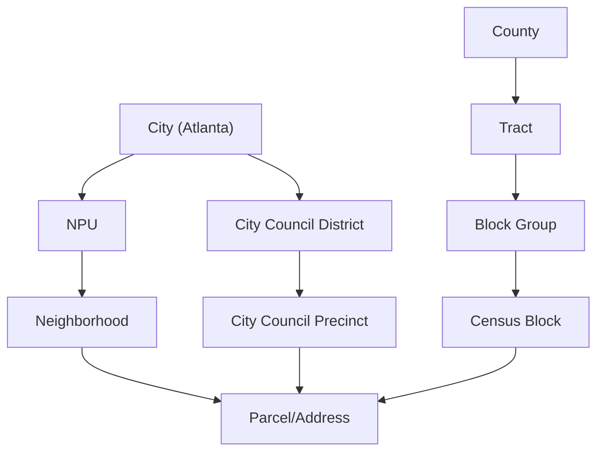

# Atlanta Geo Data

This folder contains information on Geo Data in City of Atlanta

## Geographic Hierarchy

Diagram inspired by [US Census Geographic Hierarchy](https://www2.census.gov/geo/pdfs/reference/geodiagram.pdf), showing parent/child relationships

The [mermaid](https://github.blog/2022-02-14-include-diagrams-markdown-files-mermaid/) code below is intended to be viewed on GitHub in a web browser

