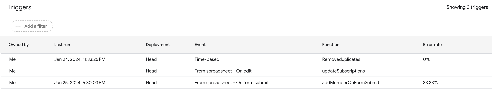

## Google Sheet

### Columns:

```
Timestamp
Email Address
Phone Number
First Name
Last Name or Business Name
Address Line 1
Address Line 2
Zipcode
Neighborhood
Subscribe to Emails
```

### Scripts

- `code.gs`:
  - Functions to manage subscriptions via "Subscribe to Emails" field
    - On Spreadsheet Edit:
      - `updateSubscriptions`: This function updates group membership if the "Subscribe to Emails" field is edited in the spreadsheet
    - On Google Form Submission:
      - `addMemberOnFormSubmit`: This function adds a new member if they selected "Yes" for "Subscribe to Emails" question when submitting the form
      - `removeMemberFromGroup`: This function removes a user from the members group if they selected "No" on the "Subscribe to Emails" question when submitting the form
  - `addMemberToGroup`: Helper function to add a user to the members group
- `macros.gs`: contains single macro, `Removeduplicates`.  This is run daily at ~11 PM
- `appsscript.json`: This is an Apps Script project manifest, which is a special JSON file that specifies a basic project information that Apps Script needs to run the script successfully.  More info [here](https://developers.google.com/apps-script/concepts/manifests)

Triggers mentioned above:


