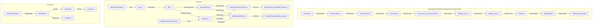

Generated initial mermaid code below with this ChatGPT prompt: https://chat.openai.com/share/88eac177-32d9-420c-8fe8-0ac391117ca1

```mermaid
graph TD
    subgraph GoogleSheet["Membership Application (Responses) Google Sheet"]
    Timestamp -->|Data Source| Email_Address
    Email_Address -->|Data Source| Phone_Number
    Phone_Number -->|Data Source| First_Name
    First_Name -->|Data Source| Last_Name_or_Business_Name
    Last_Name_or_Business_Name -->|Data Source| Address_Line_1
    Address_Line_1 -->|Data Source| Address_Line_2
    Address_Line_2 -->|Data Source| Zipcode
    Zipcode -->|Data Source| Neighborhood
    Neighborhood -->|Data Source| Subscribe_to_Emails
    end

    subgraph Code.gs
    updateSubscriptions -->|Uses| sheet
    sheet -->|Gets Data| data
    data -->|Indexed Access| userEmail
    data -->|Indexed Access| subscribeOrNot
    userEmail -->|Parameter| addMemberToGroup
    userEmail -->|Parameter| removeMemberFromGroup
    subscribeOrNot -->|Control Flow| addMemberToGroup
    subscribeOrNot -->|Control Flow| removeMemberFromGroup
    addMemberOnFormSubmit -->|Uses| userEmail
    userEmail -->|Parameter| addMemberToGroup
    addMemberToGroup -->|API Call| AdminDirectory_Members_Insert
    removeMemberFromGroup -->|API Call| AdminDirectory_Members_Remove
    end

    subgraph macros.gs
    RemoveDuplicates -->|Manipulates| spreadsheet
    spreadsheet -->|Access| currentCell
    currentCell -->|Set As| activeCell
    spreadsheet -->|Removes| duplicates
    end
```
